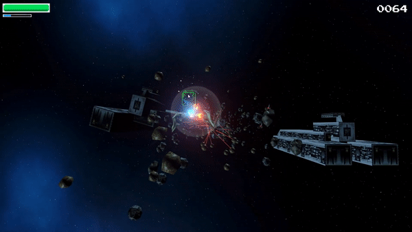

# Star Clone 46

3D videogame project developed by Alex Aguilera and Joseba Sierra based on Star Fox 64 during the subject of Videogames at Universitat Politecnica de Catalunya.  

To try the game, you just need to execute StarClone46.exe from the "Binari" folder. Perhaps a reimport of the assets is required (inside editor: right-click Assets folder -> reimport all) because we upgraded the project to Universal Render Pipeline.

