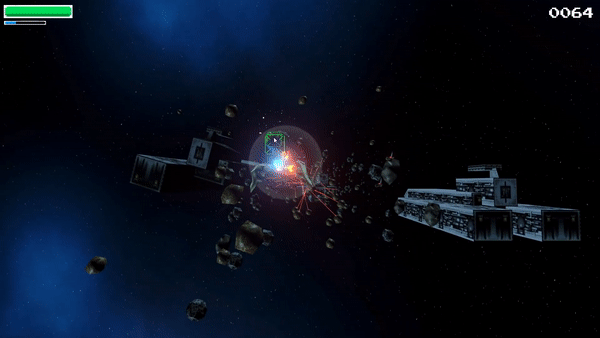

# Star Clone 46 (VJ project Q2 2019-2020)

3D videogame project developed by Alex Aguilera and Joseba Sierra based on Star Fox 64 during the subject of Videogames of Universitat Politecnica de Catalunya.  
Perhaps a reimport of the assets is required (inside editor: right-click Assets folder -> reimport all) because we upgraded the project to Universal Render Pipeline.

